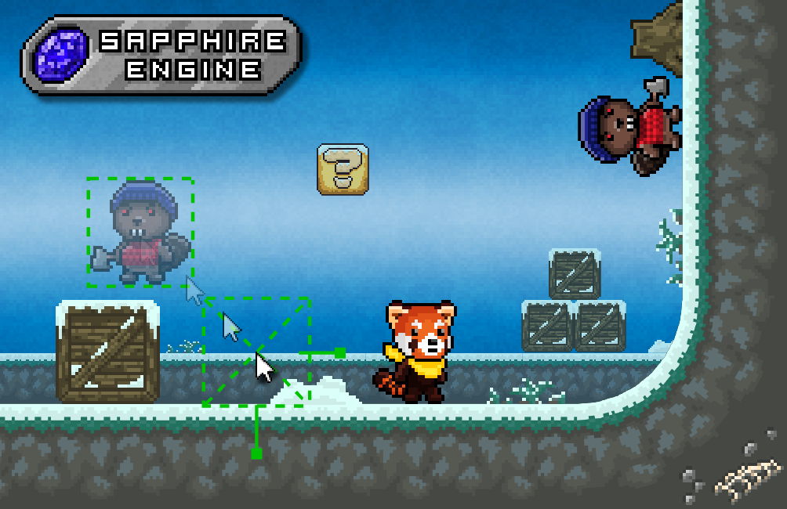

# Sapphire_Project
2D Platformer Game Engine

The purpose of this Engine is to expand my personal knowledge for developing game engines.

I started small by first focusing on creating a 2D Platformer game engine and expand it in the future.

This engine originated from an university assignment where I had to create a simple 2D Platformer game.
The catch is that I added an unique element which is that you can set the local gravity per tile/region for some unique gameplay scenarios.

## Quick Mockup

